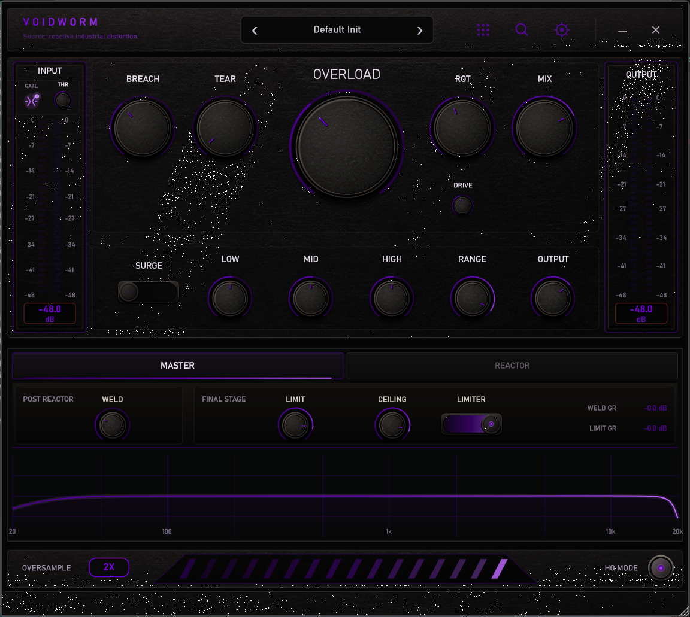
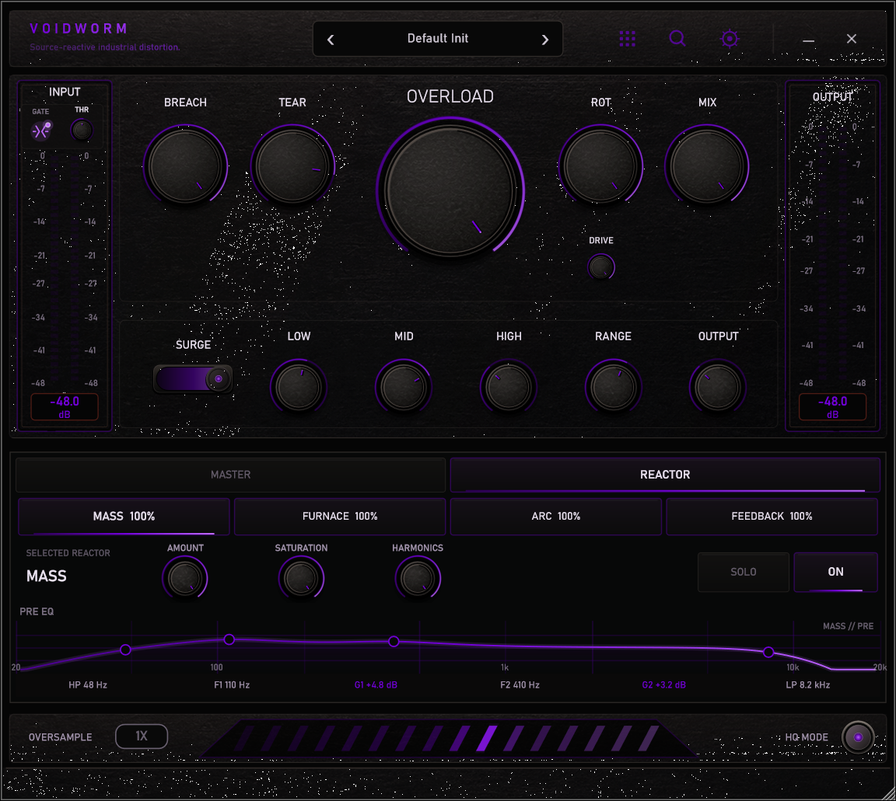
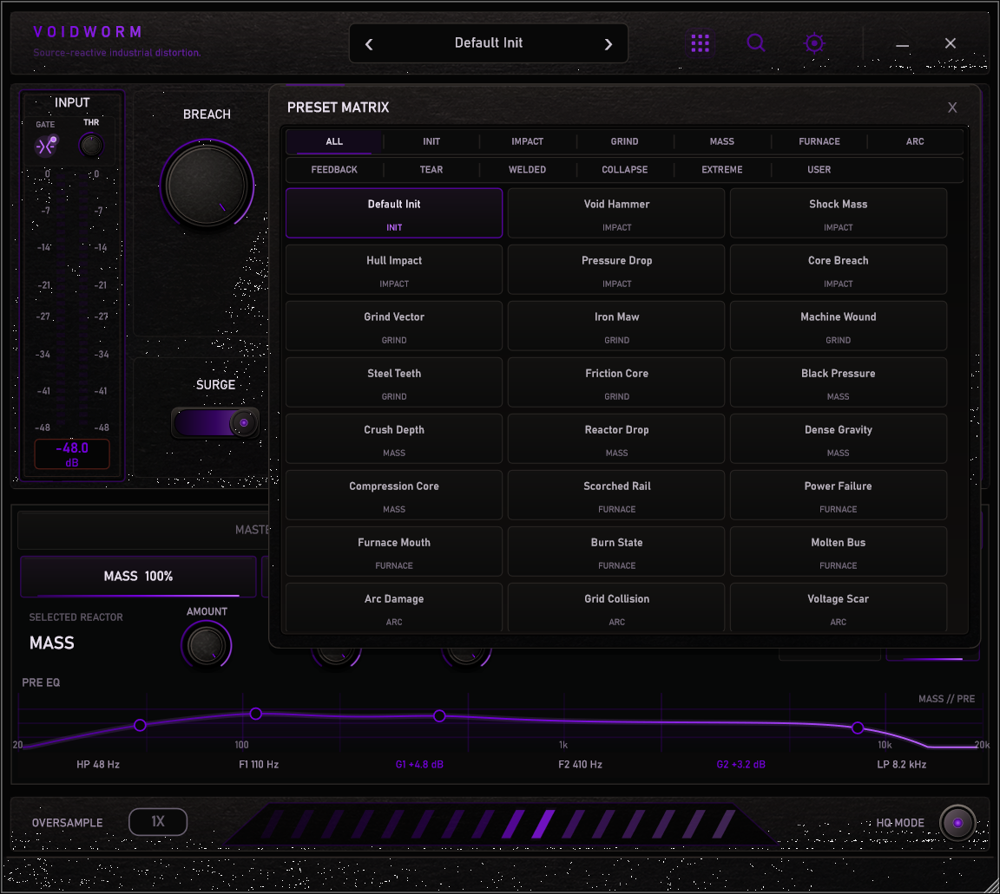
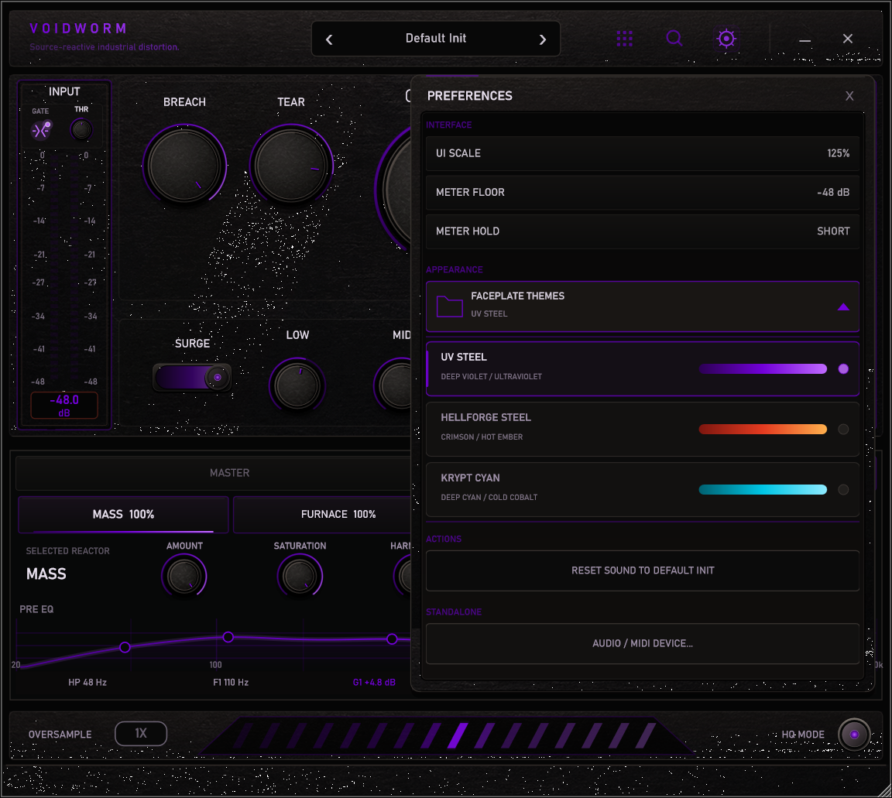
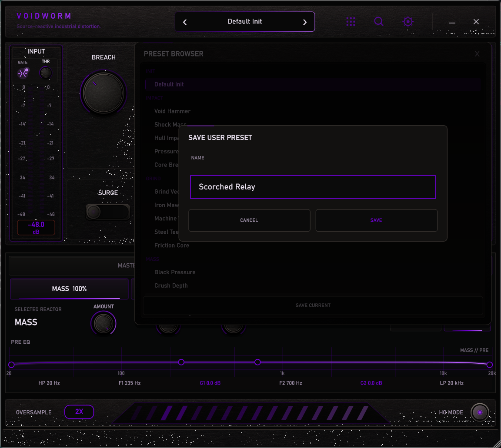

<p align="center">
  
</p>

<h1 align="center">VOIDWORM</h1>

<p align="center"><em>Source-reactive industrial distortion for Windows.</em></p>

<p align="center">
  <a href="https://github.com/lew0nn/voidworm/releases/tag/v1.0.0"></a>
  <a href="#download"></a>
  <a href="#download"></a>
  <a href="https://github.com/juce-framework/JUCE/releases/tag/8.0.8"></a>
  <a href="CMakeLists.txt"></a>
  <a href="LICENSE"></a>
  <a href="https://github.com/lew0nn/voidworm/releases/latest"></a>
</p>

<p align="center">
  
</p>

<p align="center"><strong>The controls set the processing. The source determines how it reacts.</strong></p>

VOIDWORM follows the incoming signal instead of laying the same static distortion response over everything. Dynamics, transient shape, sustain, and spectral balance drive four parallel paths - MASS, FURNACE, ARC, and FEEDBACK - before they are recombined, welded, torn, tone-shaped, and contained.

## Reactors

- **MASS:** Fundamental weight, low-order harmonics, low-end pressure.
- **FURNACE:** Starvation, grind, fuzz, folding, hostile midrange.
- **ARC:** Source-derived metallic/electrical intermodulation.
- **FEEDBACK:** Short bounded nonlinear recursion and unstable texture.

<p align="center">
  
</p>

## Presets & interface

**49 factory presets across 11 families, plus persistent user presets.**

`INIT · IMPACT · GRIND · MASS · FURNACE · ARC · FEEDBACK · TEAR · WELDED · COLLAPSE · EXTREME`

Void Hammer, Core Breach, Iron Maw, Machine Wound, and Steel Teeth are starting points for different kinds of impact, pressure, abrasion, and failure.

<p align="center">
  
</p>

Factory and user presets share one browser, matrix, and real-time search system. The interface also provides scalable workspaces, independent meter preferences, a compact input gate, and twelve faceplates.

<details>
<summary><strong>More interface views</strong></summary>

<p align="center">
  
</p>

<p align="center"><sub>Twelve faceplates, selected from the dedicated appearance panel.</sub></p>

<p align="center">
  
</p>

<p align="center"><sub>Name and store custom sounds directly from the preset browser.</sub></p>

</details>

## Download

### [Windows installer](https://github.com/lew0nn/voidworm/releases/download/v1.0.0/VOIDWORM-1.0.0-Windows-x64-Setup.exe)

Installs the VST3 plug-in, the Standalone application, or both.

### [MSI installer](https://github.com/lew0nn/voidworm/releases/download/v1.0.0/VOIDWORM-1.0.0-Windows-x64.msi)

Installs both the VST3 plug-in and Standalone application through Windows Installer.

### [VST3](https://github.com/lew0nn/voidworm/releases/download/v1.0.0/VOIDWORM-1.0.0-Windows-x64-VST3.zip)

The complete `VOIDWORM.vst3` bundle for Windows x64 hosts.

### [Standalone](https://github.com/lew0nn/voidworm/releases/download/v1.0.0/VOIDWORM-1.0.0-Windows-x64-Standalone.zip)

Runs VOIDWORM without a DAW and includes integrated Audio/MIDI device settings.

## Technical details

<details>
<summary><strong>Controls & signal path</strong></summary>

The input gate is stereo-linked, enabled by default, and positioned before dry capture, DRIVE, source analysis, and the reactor engine. BREACH cross-contaminates reactor paths; TEAR introduces post-reactor micro-fragment damage; ROT and OVERLOAD control nonlinear severity; SURGE escalates the engine dynamically.

Each reactor has independent amount, on/off, Solo, high-pass and low-pass boundaries, two focus bands, and path-specific character controls. WELD is the artistic nonlinear stage after recombination. LOW, MID, HIGH, RANGE, and OUTPUT shape the master signal before the dedicated final limiter.

MIX uses a latency-aligned dry path. Oversampling supports 1X, 2X, 4X, and 8X with a separate HQ processing mode.

</details>

<details>
<summary><strong>Presets, themes & state</strong></summary>

User presets support Save, Load, Overwrite, Rename, Delete, and Search. They are stored as versioned `.voidwormpreset` files under the user's application-data directory.

The twelve faceplates are UV STEEL, HELLFORGE STEEL, KRYPT CYAN, XENO ACID, VOID AMBER, TOXIC BRASS, PLASMA BLUE, NUCLEAR LIME, BLOOD COPPER, ASHEN GOLD, GLACIER TEAL, and RUPTURE RED. UV STEEL is the default.

Host state uses stable parameter IDs. Reactor Solo is a transient runtime control and is not restored as persistent session state.

</details>

<details>
<summary><strong>Manual installation</strong></summary>

### VST3

Extract the VST3 package and copy the complete `VOIDWORM.vst3` bundle to:

```text
C:\Program Files\Common Files\VST3
```

Rescan plug-ins in the host.

### Standalone

Extract the Standalone package and run `VOIDWORM.exe`. Audio/MIDI configuration is available from the Settings panel.

</details>

<details>
<summary><strong>Build from source</strong></summary>

Requirements: Windows x64, CMake 3.22+, Visual Studio 2022 with the MSVC desktop C++ toolchain, Git, and the pinned JUCE submodule.

Clone the `voidworm` branch together with its pinned submodules. From the repository root, run:

```powershell
powershell -ExecutionPolicy Bypass -File .\build-release.ps1
```

Raw distributable outputs are written to:

```text
dist/VOIDWORM.vst3
dist/VOIDWORM.exe
```

Built with C++17, JUCE 8.0.8, and CMake.

</details>

## License

<p align="center">
  <strong><a href="LICENSE">GNU Affero General Public License v3.0</a></strong>
</p>

<p align="center">VOIDWORM original source code and original project assets are free and open-source software.</p>

<p align="center">JUCE and all other third-party components retain their respective licences.<br>See <a href="THIRD_PARTY_NOTICES.md">Third-Party Notices</a>.</p>

<p align="center"><sub>Copyright © 2026 lewonn / LWNX DSP.</sub></p>

<p align="center"><strong>VOIDWORM 1.0.0 · LWNX DSP</strong></p>
